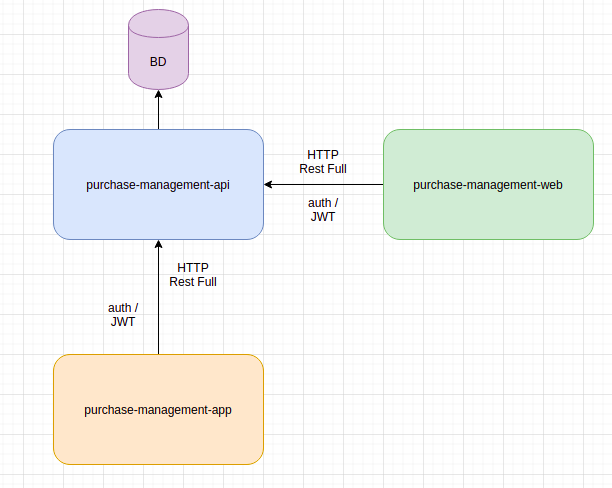

# purchase-management-api
purchase Management API 

This project is API of / purchase-management project

# project overview 
  
  
  
  

# API arquitecture 
  We are use the spring boot base arquitecture.
  
  
  
# technologies 

<ul>
  <li>Java14</li>
  <li>Gradle</li>
  <li>Mongodb/Redis</li>
  <li>JWT</li>
  <li>AUTH</li>
  <li>Jackson</li>
  <li>SpringBoot</li>
  <li>Sprint Data JPA</li>
  <li>Sprint Security</li>
  <li>Lombok</li>
</ul>

# Gerenciamento compras - Requisitos
## MVP - Requisitos Funcionais: 

Quando estiver em casa, eu enquanto usuário quero informar o produto, e quantidade de itens que desejo comprar.
   

Quando estiver no super mercado assim que incluir o item no carrinho de compras eu quero adicionar meus itens no aplicativo. informando valor, quantidade e produto.  (quero no final informar qual foi o supermercado e ter o valor total da minha compra)

# Objetivo do app

<ul>
  <li>Saber o que preciso comprar.</li>
  <li>Saber o que cade eu comprei.</li>
  <li>Saber se comprei tudo.</li>
  <li>Saber o valor de cada item.</li>
  <li>Colaborativamente, Quero em qual mercado tem o melhor valor.</li>
</ul>

# Layout 
  

 
